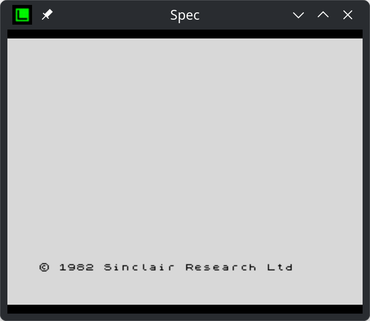
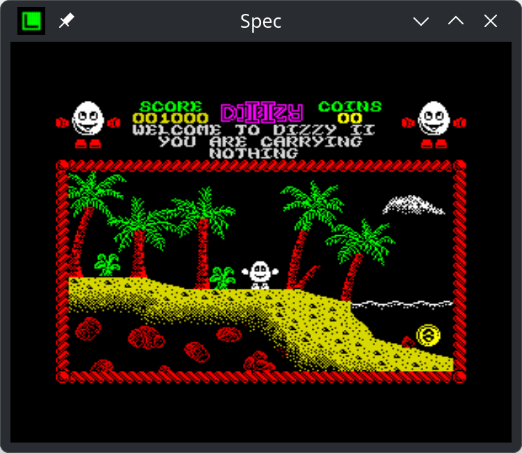
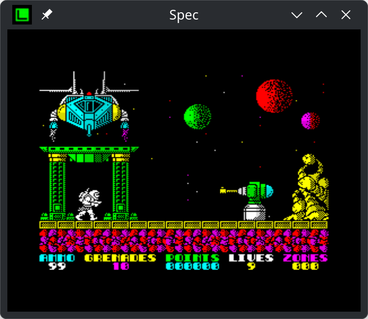

# Spec

A **ZX Spectrum 48K** emulator written in [Unleashed Pascal](https://unleashedpascal.org/), rendered
with [raylib](https://www.raylib.com/). Tested on Windows, Linux, macOS and the
Raspberry Pi — including bare DRM/KMS on the Pi with no desktop, so it turns
straight into a full-screen Spectrum.

<p align="center">
  
  
  
</p>

## Features

- **Accurate Z80 core** — built on the
  [Z80](https://github.com/redcode/Z80) CPU library by Manuel Sainz de Baranda y
  Goñi, via Pascal bindings by Zoran Vučenović.
- **Faithful ULA emulation** — memory-contention timing, mid-frame border-color effects.
  - **Direct-pixel video** — the Spectrum bitmap is written straight into the
  frame buffer through an attribute lookup table, then scales up to any window size.
- **CRT / display modes** (F11 to cycle):
  - Color CRT — curvature, scanlines, phosphor glow
  - Black & white CRT
  - Modern (smooth) and Modern (sharp)
  - Modern (scaleFX) — pixel-art upscaling
- **Sound** — beeper output and audible tape loading, with turbo/fast-forward.
- **Media**:
  - `.z80` snapshots — load and save
  - `.tap` tapes — fast-load trap, auto-started on `LOAD ""`
  - `.wav` tapes — real-time EAR-line playback for turbo-loaders and custom
    loading schemes, with auto-pause on silence
- **On-screen menu (OSD)** with a browsable **game catalog** — a scrolling list
  of titles with a live screenshot preview beside each.
- **On-screen keyboard overlay** for the Spectrum's keyword layout.
- **Configurable input** — remap the keyboard, bind a gamepad, and switch
  joystick emulation between Kempston, Cursor/Protek, Sinclair and
  Spanish (QAOPM).
- **Per-game quick-save / quick-load.**
- **Screenshot capture** to PNG.

## Not implemented

This is a focused 48K emulator. It deliberately leaves out:

- **A hand-written Z80 core** — instruction decoding is delegated to the external
  [Z80](https://github.com/redcode/Z80) C library rather than implemented in
  Pascal.
- **128K models** — no 128K/+2/+3 memory paging, so 128K-only releases won't run.
- **AY-3-8912 sound** — beeper only; no AY music.
- **Disk interfaces** — no +3 disk, Beta/TR-DOS, `.dsk`/`.trd`/`.scl`, or
  Interface 1 / microdrive.
- **Other snapshot/tape formats** — no `.sna`, `.szx`, `.tzx`, or `.rzx`; loading
  is limited to `.z80`, `.tap` and `.wav`.

## First run: unsigned builds

The released binaries are **not code-signed or notarized**, so Windows and macOS
will refuse to launch them until you say otherwise. Nothing is wrong with the
download — the operating system simply has no certificate to check it against.
If you would rather not bypass the warning, [build from source](#building)
instead; a binary you compile yourself is not quarantined.

### macOS

Gatekeeper reports *"Apple could not verify 'spec' is free of malware"* and
offers only **Move to Trash**. Solution:

- **Strip the quarantine flag**:

  ```sh
  xattr -dr com.apple.quarantine spec libZ80.dylib
  ```

### Windows

SmartScreen shows *"Windows protected your PC"*. Click **More info → Run
anyway**. If the executable came out of a ZIP, Windows may also mark it as
blocked; clear that with either:

- **File Properties** — right-click `spec.exe` → **Properties** → tick
  **Unblock** at the bottom of the **General** tab → **OK**.
- **PowerShell**:

  ```powershell
  Unblock-File .\spec.exe
  ```

Some antivirus products flag unsigned Pascal/raylib executables as unknown
rather than malicious; you may need to add an exclusion for the folder.

## Controls

### Function keys

| Key | Action |
| --- | --- |
| `F1` | Open the emulator menu (also the gamepad's Menu button) |
| `F2` | Quick-save the current machine state |
| `F3` | Quick-load the last quick-saved state |
| `F5` | Play/pause the loaded `.wav` tape (only while a tape is loaded) |
| `F6` | Cycle to the next joystick emulation mode |
| `F7` | Decrease volume — hold `Shift` for overscan instead |
| `F8` | Increase volume — hold `Shift` for overscan instead |
| `F9` | Toggle the on-screen keyboard overlay |
| `F10` | Toggle fullscreen |
| `F11` | Switch TV-set / display mode |

### Other keys

| Key | Action |
| --- | --- |
| `Tab` | Jump straight to the catalog (skips the menu's top page) |
| `Esc` | Press once to arm quit, press again within 2 s to quit |
| `` ` `` (grave) | Hold for turbo (fast-forward) |
| `Scroll Lock` | Save a screenshot PNG of the current display |

Saved files land in the folder described under [Where files are
written](#where-files-are-written).

## Getting the games

No games or tape images ship with the emulator. Drop `.z80`, `.tap` or `.wav`
files anywhere and open them from the menu (**Load file**).

To use the built-in catalog, create a `catalog/` folder next to the binary
containing a `catalog.csv`:

```csv
name,file
Arkanoid,arkanoid.z80
Batty,batty.tap
```

Put each `file` in the same folder. An optional screenshot with the same base
name (`arkanoid.png`) is shown in the preview pane.

### Where the catalog is looked for

`[Files] CatalogPath` in `spec.conf` names the folder outright:

```ini
[Files]
CatalogPath=~/Games/Spectrum/catalog
```

A leading `~` is expanded; the path is otherwise taken at its word, and nothing
else is tried — so a typo shows up as an empty catalog rather than a different
one quietly loading in its place.

Left unset, the folder is looked for in the working directory first, then next
to the binary. On macOS a bundle adds two more places, since the binary itself
is buried in `spec.app/Contents/MacOS/`:

| Where | For |
| --- | --- |
| Next to `spec.app` | A catalog the player can add games to |
| `spec.app/Contents/Resources/catalog/` | A catalog shipped inside the app |

Outside beats inside, so a catalog next to the bundle overrides one shipped
within it. A catalog in `Contents/Resources/` is covered by the code signature
— which is what stops the player adding to it, and means it has to be in place
before `macos-bundle.sh` signs. Running with `LogLevel=0` prints which one was
picked.

## Where files are written

Snapshots, taped programs, screenshots and `spec.conf` all go to the same
folder:

| Platform | Folder |
| --- | --- |
| Windows, Linux | The folder the emulator was started from |
| macOS | `~/Library/Application Support/spec/` |

macOS is the odd one out because Finder launches an `.app` with the root of
the disk as its working directory, and writing next to the bundle would break
the signature it was sealed with. Setting `SPEC_DATA_DIR` overrides the choice
everywhere, and `[Files] SavePath` moves the snapshots (and with them the
screenshots and taped programs) somewhere else again.

## Configuration

Settings live in `spec.conf` (INI format) — see the table above for where —
and are written back when you change them in the menu. Notable sections:

```ini
[Window]
Width=720
Height=576
Fullscreen=1

[Display]
TVMode=0          ; 0=Colour CRT, 1=BW CRT, 2=Modern smooth, 3=Modern sharp, 4=scaleFX
Overscan=16
Curvature=8

[Audio]
Volume=0.65
Muted=0

[Files]
SavePath=         ; empty = the default write folder; ~ is expanded
CatalogPath=      ; empty = search the usual places

[Joystick]
Index=1           ; 0=none, then Kempston, Cursor, Sinclair, Spanish

[Bindings]
Fire 1=key:Left ALT
Fire 2=key:Right ALT

[Bindings:usb gamepad]
Left=pad:DPAD_LEFT, axis:LEFT_X-
Fire 1=pad:FACE_DOWN
```

## Building

### Requirements

- [Unleashed Pascal compiler](https://unleashedpascal.org/)
- [ray4laz](https://github.com/GuvaCode/ray4laz) package installed (provides the raylib bindings and libraries).

### Desktop (Windows / Linux / macOS)

Open `spec.lpi` in Lazarus (Unleashed IDE) and build the **Release** mode, or from the command
line:

```sh
lazbuild --build-mode=Release spec.lpi
```

The native `Z80` shared library for your platform is in `lib/`
(`libZ80.so`, `Z80.dll`, `libZ80.dylib`). It is not linked in — the emulator
opens it at runtime — and it is looked for, in order, at `$LIBZ80_PATH`, then
`./` and `./lib/` relative to the working directory, then the same two next to
the executable, and on macOS in the bundle's `Contents/Frameworks/`. Keeping it
beside the executable covers every case.

## Project layout

| Path | Purpose |
| --- | --- |
| `spec.lpr` / `main.pas` | Application entry point and main loop |
| `spectrum.pas` | ZX Spectrum 48K machine — ULA, video, tape, contention |
| `Z80/Z80.pas` | Pascal bindings for the Z80 CPU library |
| `keyboards.pas` / `joysticks.pas` / `inputs.pas` | Input handling and mapping |
| `osdmenu.pas` / `catalogs.pas` | On-screen menu and game catalog |
| `appsettings.pas` | `spec.conf` reader/writer |
| `utils.pas` | Platform odds and ends, including where the emulator writes |
| `shaders/` | GLSL fragment shaders for the display modes |
| `rom/48.rom` | Spectrum 48K ROM |
| `macos-bundle.sh` | Assembles and signs `spec.app` |

## Licensing

The emulator's own source code is released under the **MIT License**
(see `LICENSE`).

Bundled third-party components keep their own terms:

- **ZX Spectrum 48K ROM** (`rom/48.rom`) — © Amstrad plc. Amstrad have given
  permission to redistribute their copyrighted material for use in emulators,
  provided the copyright messages are not altered; Amstrad retain that
  copyright. See `licenses/Amstrad ROM.txt`.
- **Z80 CPU library** — © Manuel Sainz de Baranda y Goñi, GNU LGPL v3.
  See `licenses/Z80.txt`.
- **Fake Receipt font** (`fonts/`) — Raymond Larabie, released CC0.
  See `licenses/Fake Receipt.txt`.

Game snapshots and tape images are the copyright of their respective authors and
are not distributed with this project.
